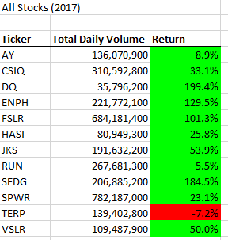
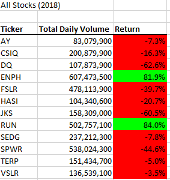
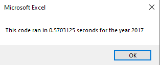
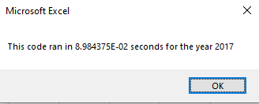
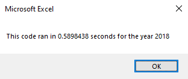
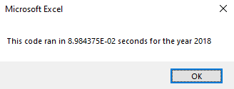

# Stock Analysis with Excel VBA

## Overview of Project
 
### Purpose

The purpose of the project is to analyze stock data using VBA. Then refractor it to make it run more efficiently.

## Results

### Comparing Stock Performance in 2017 vs 2018

The following tables depict the performance of a given ticker over the course of a calendar year.

ENPH and RUN are the only 2 tickers to have 2 consecutive years with a positive return. TERP is the only ticker to have 2 consecutive years with a negative return. All other tickers have positive years in 2017 and then negative years in 2018.

### Comparison of Execution Times, Original vs Refactored

The refactored code runs significantly faster than the original code as shown in the following figures.

Time to Execute Original 2017

Time to Execute Refactored 2017

Time to Execute Original 2018

Time to Execute Refactored 2018

The efficiency increase can be attributed to the removal of the nested for loop in the refactored code.

Original

    For i = 0 To 11
       ticker = tickers(i)
       totalVolume = 0
       '5) loop through rows in the data
       Worksheets(yearValue).Activate
       For j = 2 To RowCount
           '5a) Get total volume for current ticker
           If Cells(j, 1).Value = ticker Then

               totalVolume = totalVolume + Cells(j, 8).Value

           End If
           '5b) get starting price for current ticker
           If Cells(j - 1, 1).Value <> ticker And Cells(j, 1).Value = ticker Then

               startingPrice = Cells(j, 6).Value

           End If

           '5c) get ending price for current ticker
           If Cells(j + 1, 1).Value <> ticker And Cells(j, 1).Value = ticker Then

               endingPrice = Cells(j, 6).Value

           End If
       Next j

Refactored

    tickerIndex = 0

    '1b) Create three output arrays
    Dim tickerVolumes(12) As Long
    Dim tickerStartingPrices(12) As Single
    Dim tickerEndingPrices(12) As Single
    
    ''2a) Create a for loop to initialize the tickerVolumes to zero.
    For i = 0 To 11
    
        tickerVolumes(i) = 0
    
    Next i
    ''2b) Loop over all the rows in the spreadsheet.
    For i = 2 To RowCount
    
        '3a) Increase volume for current ticker
        If Cells(i, 1).Value = tickers(tickerIndex) Then
        
        tickerVolumes(tickerIndex) = tickerVolumes(tickerIndex) + Cells(i, 8).Value
        
        End If
        '3b) Check if the current row is the first row with the selected tickerIndex.
        If Cells(i - 1, 1).Value <> tickers(tickerIndex) And Cells(i, 1).Value = tickers(tickerIndex) Then
            
        tickerStartingPrices(tickerIndex) = Cells(i, 6).Value
            
        End If
        
        '3c) check if the current row is the last row with the selected ticker
         'If the next row’s ticker doesn’t match, increase the tickerIndex.
        If Cells(i + 1, 1).Value <> tickers(tickerIndex) And Cells(i, 1).Value = tickers(tickerIndex) Then

            tickerEndingPrices(tickerIndex) = Cells(i, 6).Value
            
            '3d Increase the tickerIndex.
            tickerIndex = tickerIndex + 1
            
        End If
            
    Next i

The change will stop `RowCount` * 10 iterations from executing. 

## Summary

- What are two conclusions you can draw about the Outcomes based on Launch Date?

Two conclusions I can draw about the outcomes based on launch date are may has the most successful campaigns and December has the least number of successful campaigns.

- What are the advantages or disadvantages of refactoring code?

There are multiple advantages of refactoring code. One of these advantages is code can be rewritten for efficiency allowing the code to process larger data sets. Another advantage is one can organize the code to make it easier to read. Refactoring code can also have disadvantages. Anytime something is touched there is room for error. If a mistake is made code that was previously working may have to go through large amounts of debugging. Next, refactoring takes time costing the owners of the project money.

- How do these pros and cons apply to refactoring the original VBA script?

When refactoring the code for this project I made mistakes when coping existing code. I either did not copy the full block of code that I wanted or forgot to change the variables to the new arrays defined in the refactored code. Though this took some time to debug the efficiency boots are worth the time spent.
